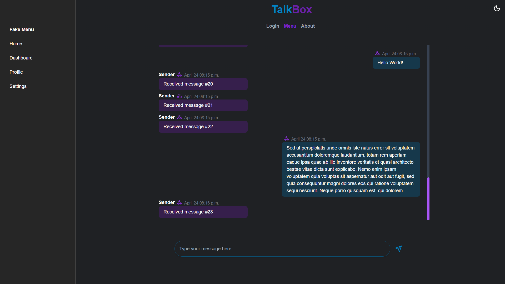
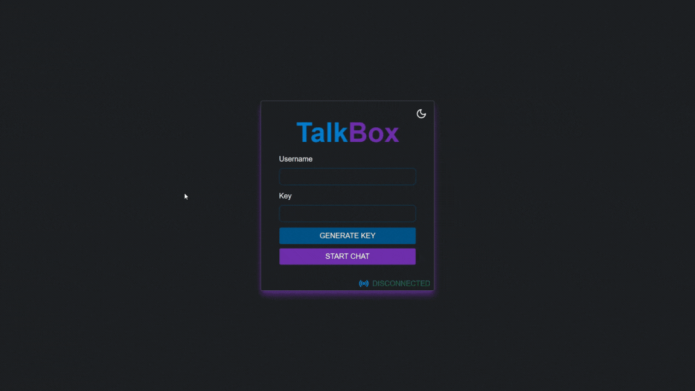

# TalkBox

## :camera: Overview

<div align="center" >
  
  
</div>

<br>

<br>
<div id="usage">
  <h2>:hammer_and_wrench: Still working on this project!</h2>
</div>

### For now, here is the main idea behind it:
A website with a chat where you can summon the oracle. In a chat with two or more people, it will be possible to summon ChatGPT to converse mutually. One idea I have is that the room will have an admin, and the system will be similar to the "raise hand" feature of Google Meet. When clicking the "call the oracle" button, a queue will form starting from whoever raises their hand. Once ChatGPT finishes responding to one person, the admin chooses the next person to receive a response.

<br>
<div id="technologies">
  <h2>:rocket: Technologies</h2>
</div>

### Backend

✔️ TypeScript | ✔️ Nest | ✔️ Socket.IO

### Frontend

✔️ TypeScript | ✔️ ReactJS | ✔️ NextJS | ✔️ TailwindCSS

<br>
<div id="running_backend">
  <h2>⚙ Running [Backend]</h2>
</div>

```bash
# Clone this repository
$ git clone https://github.com/leonardoacr/real-time-data-transfer-socketio

# Access the backend folder

$ cd backend

# Install packages

$ npm install

# Run the server on http://localhost:8000

$ npm run start:dev
```

<br>
<div id="running_frontend">
  <h2>⚙ Running [Frontend]</h2>
</div>

```bash
# Access the frontend folder

$ cd frontend

# Install packages

$ npm install

# Run the server on http://localhost:3000

$ npm run dev
```

<br>
<div id="contributing">
  <h2>:raised_hands: Contributing</h2>
</div>

If you would like to contribute to this template, please feel free to submit a pull request or open an issue to improve this template. 